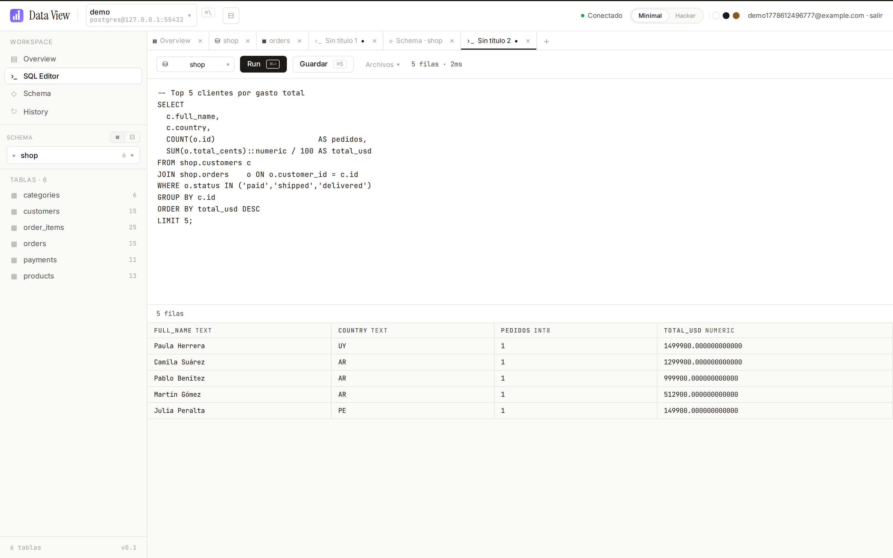
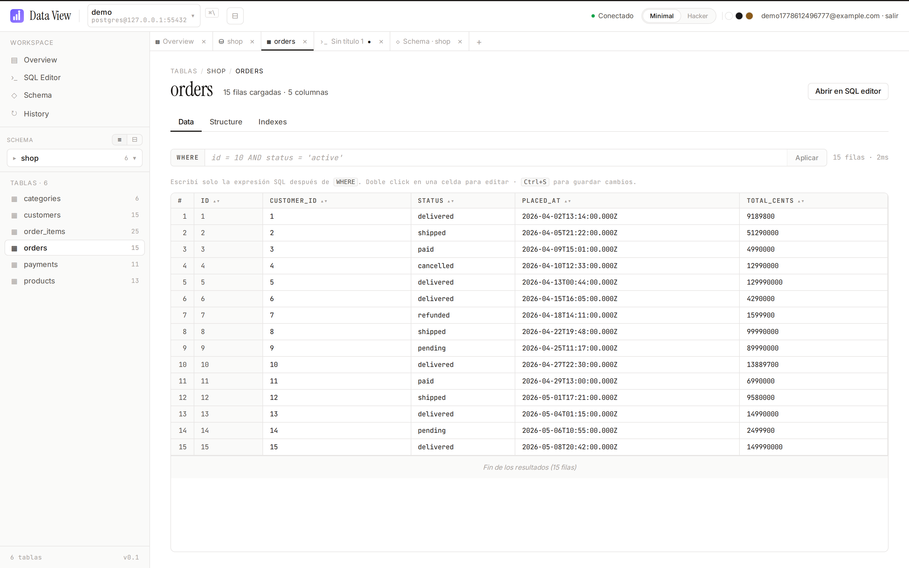
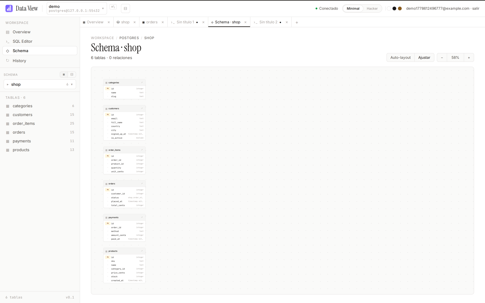

# Data View

[](LICENSE)



<p align="center">
  
  
</p>

Visor de bases de datos al estilo Beekeeper Studio. Un solo monorepo, dos targets:

- **`apps/web`** — Next.js 15 + Auth.js. Pensado para hostear en un dominio. Login multiusuario; cada usuario ve solo sus propias conexiones, con contraseñas cifradas en reposo (AES-256-GCM).
- **`apps/desktop`** — Tauri v2 + Rust. Genera un `.msi` / `.exe` para Windows (también `.dmg` para macOS y `.deb`/`.AppImage` para Linux). Login opcional; las conexiones se guardan en el directorio de configuración del usuario.

Ambas comparten:
- **`packages/core`** — tipos TS, interfaz `Transport`, helpers SQL (`generateSelectSql` / `generateInsertSql` / `generateUpdateSql` / `generateDeleteSql` / `generateFullTableDDL`, `renderForeignKeyClause`, `quoteIdent` por dialecto).
- **`packages/ui`** — componentes React: lista de conexiones, sidebar con tree, editor SQL con CodeMirror, grilla editable, modales (Create database/table, Cell viewer, Confirm dialog, Context menu), `AppShell` que orquesta todo.

Bases de datos soportadas en esta versión: **PostgreSQL · MySQL/MariaDB · SQL Server**.

---

## Features

### Editor SQL
- **CodeMirror 6** con syntax highlighting por dialecto (`PostgreSQL` / `MySQL` / `MSSQL` / `StandardSQL`).
- **Autocomplete** de keywords + nombres de schemas/databases + tablas del database activo (fetch lazy).
- **Run selection** — si hay texto seleccionado, `Ctrl/Cmd+Enter` ejecuta solo eso; si no, el buffer entero.
- **Format SQL** con [`sql-formatter`](https://github.com/sql-formatter-org/sql-formatter) (keywords upper, indent 2, dialecto por driver).
- **EXPLAIN** — prefija `EXPLAIN ` automáticamente (`SET SHOWPLAN_TEXT ON` en SQL Server) y muestra el plan en la grilla.
- Hotkeys: `Ctrl/Cmd+Enter` = Run, `Ctrl/Cmd+S` = Guardar archivo.
- Multi-cursor, fold gutter, búsqueda nativa (`Ctrl+F`), bracket matching, history (undo/redo).
- Theme dark/light sincronizado con el `ThemeProvider`.

### Browser de schemas y tablas
- Vista por **schema activo** o **árbol** completo del connection.
- Vista **global** que muestra todos los connections con sus schemas/tablas anidadas.
- **Búsqueda dentro del tree** — input que filtra schemas y tablas en los schemas ya cargados.
- **Clic derecho** sobre tablas y schemas abre un menú contextual:
  - Tabla: Abrir · Generar CREATE TABLE / SELECT / INSERT / UPDATE / DELETE · TRUNCATE · DROP
  - Schema: Crear tabla acá · DROP schema/database

### DDL completo
- **Crear schema/database** con form (charset/collation MySQL, owner Postgres).
- **Crear tabla** con editor visual:
  - Selector de tipos por driver (`serial`, `INT AUTO_INCREMENT`, `nvarchar(n)`, `decimal(p,s)`…) con inputs para parámetros (length, precision, scale).
  - Soporte de **ENUM** con editor de chips — en MySQL emite `ENUM(...)`, en Postgres/MSSQL convierte a `CHECK (col IN (...))`.
  - Sección avanzada para **foreign keys** (multi-columna, `ON UPDATE`/`ON DELETE`) e **índices** (UNIQUE opcional).
- **ALTER TABLE** desde la pestaña *Structure* — agregar/borrar/renombrar columnas, cambiar tipos, defaults, NULL/NOT NULL.
- **Gestión de índices** desde la pestaña *Indexes* — crear (UNIQUE opcional) y borrar con confirmación.
- **DROP table/schema/database** y **TRUNCATE** con `ConfirmDialog` typed-name guard y toggle `CASCADE` (solo en Postgres).
- **Generar DDL completo**: `CREATE TABLE` + `CREATE INDEX` + `ALTER TABLE ADD CONSTRAINT FK` listo para pegar en otro entorno.

### Edición de datos
- **Grilla editable** con doble-clic en celda, navegación con flechas/Ctrl+Flecha, paste de matrices tabuladas.
- **Insertar filas** en blanco con `+ Agregar fila` y `Ctrl+S` para guardar.
- **Cell viewer modal** (clic derecho en la grilla / doble-clic en results) — JSON pretty-print con tabs JSON/Texto crudo, info de blobs, copy al clipboard.
- **Filtrar resultados** — input en el header de `ResultsTable` que filtra filas client-side.

### Archivos y workspace
- Tabs estilo VS Code: preview (single-click) vs pinned (double-click), reordenar, **grupos** colapsables con nombre.
- **Saved SQL files** por connection — guardar, abrir, borrar.
- **Abrir `.sql` del disco** — en desktop usa el dialog de Tauri + lectura UTF-8 (límite 16 MB); en web cae a `<input type="file">`.
- **Export** a CSV / JSON / SQL desde cualquier resultado o tabla completa.
- **Export database** — dump multi-schema a un único `.sql`.

### Conexiones y workspace
- Multi-conexión con **carpetas** y **tags** (con colores) para organizar.
- Tags `system` (Test/Producción) seedeados automáticamente.
- Modo `globalTreeView` para navegar todos los connections desde el sidebar.
- En la web cada usuario solo ve sus propias conexiones.

---

## Estructura

```
data-view/
├── apps/
│   ├── web/            # Next.js 15 + Auth.js + drivers TS (pg, mysql2, mssql)
│   └── desktop/        # Tauri v2 + Rust (tokio-postgres, mysql_async, tiberius)
├── packages/
│   ├── core/           # Tipos TS + interfaz Transport
│   └── ui/             # Componentes React compartidos
├── pnpm-workspace.yaml
└── tsconfig.base.json
```

## Cómo encajan las dos versiones

```
┌──────────────────────────┐    ┌──────────────────────────┐
│   apps/web (Next.js)     │    │  apps/desktop (Tauri)    │
│                          │    │                          │
│   AppShell ◀── @data-view/ui  ──▶  AppShell              │
│       │                  │    │       │                  │
│   WebTransport           │    │   TauriTransport         │
│   fetch('/api/...')      │    │   invoke('...')          │
│       │                  │    │       │                  │
│   Next.js route handlers │    │   Tauri commands (Rust)  │
│   pg / mysql2 / mssql    │    │   tokio-postgres /       │
│   Auth.js + SQLite users │    │   mysql_async / tiberius │
└──────────────────────────┘    └──────────────────────────┘
```

La UI es la misma. Lo único que cambia es el `Transport` que se inyecta.

---

## Requisitos

- **Node 20+** y **pnpm 11+** (`npm i -g pnpm`)
- Para compilar el desktop: **Rust 1.77+** (`rustup`) y las dependencias de Tauri:
  - **Windows**: WebView2 (incluido en Windows 11). Para compilar desde Linux usá `cargo-xwin` o construí en CI con `windows-latest`.
  - **Linux** (dev local): `libwebkit2gtk-4.1-dev libgtk-3-dev libsoup-3.0-dev libjavascriptcoregtk-4.1-dev`
  - **macOS**: Xcode Command Line Tools.

Documentación oficial de prerequisitos: <https://v2.tauri.app/start/prerequisites/>

## Setup

```bash
pnpm install
```

---

## Versión web

```bash
cp apps/web/.env.example apps/web/.env.local
# Generá los dos secrets:
echo "AUTH_SECRET=$(openssl rand -base64 32)" >> apps/web/.env.local
echo "DATA_VIEW_MASTER_KEY=$(openssl rand -base64 32)" >> apps/web/.env.local

pnpm dev:web
# → http://localhost:3000
```

Primer usuario: clic en "Registrarme". Después podés deshabilitar el alta seteando
`ALLOW_SIGNUP=false`.

### Persistencia

- Usuarios y conexiones viven en SQLite local (`apps/web/data/local.db` por default).
- Las contraseñas de las DBs se cifran con AES-256-GCM usando `DATA_VIEW_MASTER_KEY`.
- Cada usuario solo ve sus propias conexiones; las queries van a la base destino con la cuenta de cada usuario.

### Deploy

Cualquier host de Next.js sirve (Vercel, Render, Railway, fly.io, VPS). Tené en cuenta:

- `better-sqlite3` es nativo. Si tu host no permite módulos nativos, reemplazá por Postgres como store usando los mismos repos.
- `AUTH_SECRET` y `DATA_VIEW_MASTER_KEY` son **obligatorios** en prod. Si rotás la master key, las contraseñas guardadas dejan de poder descifrarse.

---

## Versión desktop

```bash
pnpm dev:desktop      # arranca Vite + abre la ventana Tauri
pnpm build:desktop    # genera bundles en apps/desktop/src-tauri/target/release/bundle/
```

### Generar el `.msi` / `.exe` para Windows

- **Desde Windows** (recomendado): instalá Rust + Visual Studio Build Tools + WebView2 y corré `pnpm build:desktop`. El instalador queda en `apps/desktop/src-tauri/target/release/bundle/msi/` y `bundle/nsis/`.
- **Desde Linux/macOS** (cross-compile): instalá `cargo-xwin` (`cargo install cargo-xwin`) y agregá un target Rust para Windows (`rustup target add x86_64-pc-windows-msvc`); después `pnpm tauri build --target x86_64-pc-windows-msvc`.
- **Vía GitHub Actions**: usá la matriz oficial de Tauri (workflow ejemplo en <https://v2.tauri.app/distribute/pipelines/github/>).

### Persistencia

- Las conexiones se guardan en JSON dentro de `%APPDATA%/data-view/connections.json` (Windows), `~/Library/Application Support/data-view/` (macOS) o `~/.config/data-view/` (Linux).
- Las contraseñas se cifran con AES-256-GCM usando una clave derivada por Argon2id de un secreto local (rotable a futuro vía master password — el módulo `crypto.rs` está listo para extender).

### Login opcional

Esta versión todavía no fuerza login local. Si más adelante querés agregar un master password para desbloquear el archivo, el módulo `crypto.rs` ya tiene la base; alcanza con cambiar la fuente del secreto por una passphrase ingresada al inicio.

---

## Comandos útiles

```bash
pnpm typecheck         # tsc --noEmit en todos los paquetes
pnpm dev:web           # Next.js en modo dev
pnpm dev:desktop       # Vite (sin Tauri); para abrir la ventana usá pnpm tauri:dev
pnpm --filter @data-view/desktop tauri:dev     # arranca también el binario Rust
pnpm build:web
pnpm build:desktop
```

## Roadmap

### Próximo (alta prioridad)

- [ ] **SSH tunnel** — conectarse a DBs en redes privadas vía bastion. Hoy hay que abrir el puerto público o hacer `ssh -L` a mano. Implementación: `russh` o `ssh2` en Rust, `ssh2` en Node; el `ConnectionConfig` gana una sub-sección opcional con host/port/user/auth/key.
- [ ] **Master password** opcional para el desktop. El módulo `crypto.rs` (AES-256-GCM + Argon2id) ya está preparado — falta la UI de unlock al startup.
- [ ] **SSL/TLS completo** en el driver Postgres del desktop (`rustls` con verificación de certs).

### Editor / UX

- [ ] **Multi-statement** — split por `;` (respetando strings/comments) con tabs de resultados por sentencia.
- [ ] **Query parameters** (`:foo` / `$1`) con panel lateral de valores.
- [ ] **Visual EXPLAIN** — parsear el plan de Postgres y renderizarlo como árbol con costos.
- [ ] **Command palette** (`Cmd+K`) — saltar a conexión / tabla / archivo / acción.
- [ ] **Snippets** con placeholders preguntables al abrir.

### DDL avanzado

- [ ] **FKs y índices en `StructureEditor`** (hoy se manejan al crear; falta agregarlos sobre tablas existentes desde la UI — vía SQL editor sí funciona).
- [ ] **Diff de schema** entre dos conexiones → genera el script `ALTER`.
- [ ] Browser de **Views / Materialized Views / Stored Procedures / Triggers / Functions**.

### Datos

- [ ] **Import CSV/JSON** → tabla nueva o existente (cierra el roundtrip con `Export database`).
- [ ] **Restore** — botón explícito para correr un `.sql` de backup (hoy se hace con `Abrir .sql` + `Run`).

### Auth y web

- [ ] OAuth (Google/GitHub) para la web.
- [ ] Roles/permisos: ver grants, hacer `GRANT/REVOKE` con UI.
